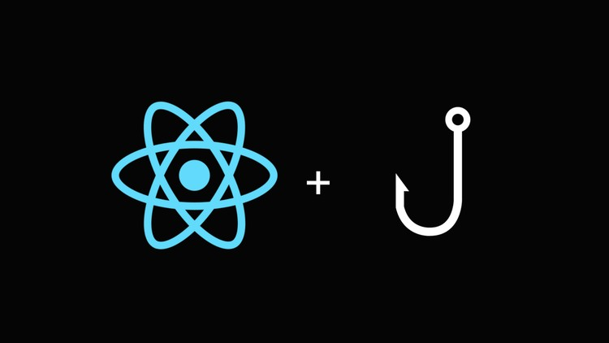

React is moving towards using Hooks and that is a good thing moving forward. Hooks are perfect for function based components and it makes the code much more compact and and easier to read and work with.

React Redux is now embracing Hooks and they made their Hooks API easier to use and apply to our current codebase.

Let's begin:

First, you should wrap your entire application in a <Provider> component to make the store available throughout the component tree:

```js
const store = createStore(reducer, initialState);

function App() {
  return (
    <Provider store={store}>
      <TodoList />
    </Provider>
  );
}

export default App;
```

### Good old component with connect()() function

If you've used React Redux before then you are familiar with the `connect()()` function which is a high-order component that injects props to the React components with actions and data from the store.

A complete example of a React function component using `connect()()` function looks like this:

```js
import React from 'react';
import { connect } from 'react-redux';

function TodoList({ items, addItem }) {
  const handleAddItem = () => {
    addItem('React-redux Hooks API is out!');
  };

  return (
    <>
      <ul>
        {items.map((item) => (
          <li key={item.id}>{item.description}</li>
        ))}
      </ul>
      <button onClick={handleAddItem}>Add Item</button>
    </>
  );
}

const mapStateToProps = (state) => {
  return {
    items: state.items,
  };
};

const mapDispatchToProps = {
  addItem: (item) => ({ type: 'CREATE_ITEM', payload: item }),
};

export default connect(mapStateToProps, mapDispatchToProps)(TodoList);
```

### Using Hooks in a React Redux App

With `useSelector()`, you can now get rid of the `connect()()` and `mapStateToProps()` and extract data from the Redux store into your function component.

You can now dispatch actions using `useDispatch()`. This hook returns a reference to the `dispatch` function from the Redux store. Also, you can use this hook together with `connect()()`.

A complete example of a React function component using React Redux Hooks look like this:

```js
import React from 'react';
import { useDispatch, useSelector } from 'react-redux';

function TodoList() {
  const items = useSelector((state) => state.items);
  const dispatch = useDispatch();

  const handleAddItem = () => {
    dispatch({ type: 'CREATE_ITEM', payload: 'React-redux Hooks API is out!' });
  };

  return (
    <>
      <ul>
        {items.map((item) => (
          <li key={item.id}>{item.description}</li>
        ))}
      </ul>
      <button onClick={handleAddItem}>Add Item</button>
    </>
  );
}

export default TodoList;
```

Now, looks more clean, readable and compact isn't it?

Note that the new Hooks API have edge cases that need to be considered but for most cases it works perfectly fine!

If you need to learn about the details, edge cases and performance optimizations, the [documentation ](https://react-redux.js.org/next/api/hooks) talks about it thoroughly.

The source code for this tutorial is on this [Github ](https://github.com/junibrosas/react-examples/tree/master/with-redux) repository.
